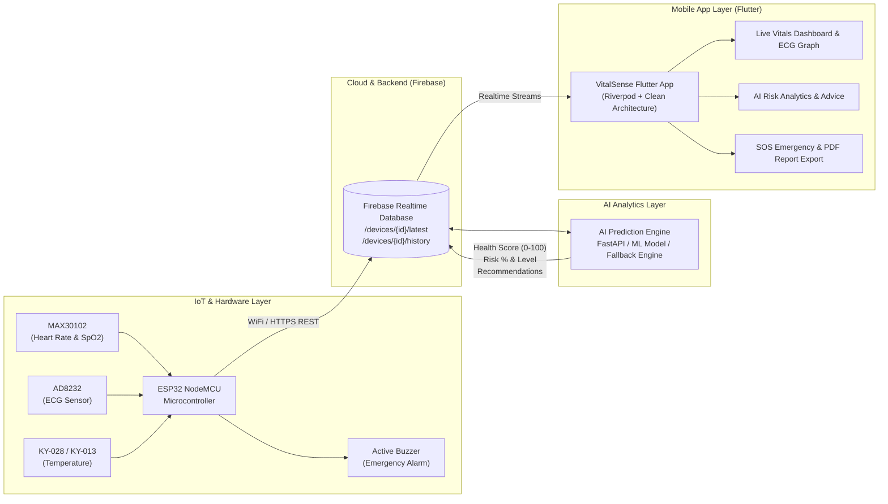

# 🏥 VitalSense — AI-Powered Remote Health Monitoring & Disease Prediction System

[](https://flutter.dev/)
[](https://dart.dev/)
[](https://www.espressif.com/)
[](https://www.arduino.cc/)
[](https://firebase.google.com/)
[](https://riverpod.dev/)

**VitalSense** is a modern, end-to-end remote health monitoring and disease prediction system. It measures a patient's vital parameters (Heart Rate, SpO2, ECG, and Body Temperature) through sensors, sends them to the cloud in real time, analyzes them with artificial intelligence (AI) to identify potential cardiovascular or systemic health risks, and presents the results instantly in a cross-platform Flutter application.

---

## 📑 Table of Contents
- [System Architecture](#-system-architecture)
- [Part 1: IoT & Sensor Hardware Layer](#-part-1-iot--sensor-hardware-layer)
- [Part 2: AI & Predictive Analytics Engine](#-part-2-ai--predictive-analytics-engine)
- [Part 3: Flutter Mobile Application](#-part-3-flutter-mobile-application)
- [Project Directory Structure](#-project-directory-structure)
- [Setup & Installation Guide](#-setup--installation-guide)

---

## 🏛 System Architecture



---

## 📡 Part 1: IoT & Sensor Hardware Layer

The hardware layer uses an **ESP32 ESP-32S NodeMCU (30-pin)** microcontroller that provides high-speed sampling and wireless connectivity.

### 1.1 Sensor and Module Specifications
| Sensor / Component | Interface | Pin Connection (ESP32) | Function / Role |
| :--- | :--- | :--- | :--- |
| **MAX30102** | I2C Protocol | SDA -> `GPIO 21`<br/>SCL -> `GPIO 22` | Pulse oximeter and heart-rate sensor. Measures blood oxygen saturation (SpO2%) and pulse rate (BPM), with finger detection and real-time FIFO reading support. |
| **AD8232 ECG** | Analog + Digital | OUTPUT -> `GPIO 34` (ADC1)<br/>LO+ -> `GPIO 26`<br/>LO- -> `GPIO 27` | Single-lead heart-rate monitor. Samples the electrocardiogram (ECG) waveform as an analog signal at 100 Hz and supports lead-off detection. |
| **Digital Temperature Module** | Digital GPIO | DATA (D0) -> `GPIO 4` | Digital thermostat sensor with an active-high signal for detecting abnormal body temperature or fever. |
| **Active Buzzer** | Digital GPIO | Signal -> `GPIO 25` | Provides an onboard sound alarm when the patient's vital signs reach critical levels. |
| **ESP32 Wi-Fi** | 802.11 b/g/n | Internal | Automatically connects to a local Wi-Fi network and sends data to the cloud. |

### 1.2 Firmware Architecture (`HealthMonitoring/`)
- **Non-blocking Cooperative Scheduler:** The firmware's `loop()` method does not use blocking `delay()`. The `millis()` timer collects readings at the configured frequency for each sensor:
   - **ECG Sampling:** 100 Hz (every 10 milliseconds)
  - **MAX30102 FIFO Polling:** Continuous / 1 Hz
   - **Temperature Voting:** 1 Hz (five-sample majority-voting filter)
  - **Buzzer State Machine:** 20 Hz
- **Noise Filtering and Majority Voting:** A five-sample sliding-window majority-voting algorithm is used for the temperature sensor to prevent false alarms caused by noise.
- **Cloud Uplink:** Data is pushed directly to the following Firebase Realtime Database nodes through `WiFiClientSecure` and REST HTTPS:
   - `/devices/{deviceId}/latest.json` (latest snapshot every second)
   - `/devices/{deviceId}/history.json` (historical log every five seconds)
   - `/alerts.json` (immediate alert when an emergency condition is detected)

---

## 🧠 Part 2: AI & Predictive Analytics Engine

The VitalSense system includes an intelligent engine that analyzes collected patient biometric data to predict cardiovascular and systemic health risks.

### 2.1 Core Features and Metrics
1. **Health Score Calculation (0 to 100):**
   - A comprehensive score from 0 to 100 represents the patient's overall health.
   - The score updates in real time using blood oxygen level ($SpO_2$), heart rate ($BPM$), and temperature.
2. **Cardiovascular and Disease Risk Assessment (risk percentage):**
   - The probability of heart disease and other health risks is calculated on a scale of 0% to 100%.
   - Risk is divided into four primary levels:
     - 🟢 **Low Risk:** Health status is within the normal range.
     - 🟡 **Moderate Risk:** Minor deviations that require attention.
     - 🟠 **High Risk:** Immediate lifestyle changes or medical advice may be required.
     - 🔴 **Critical Risk:** Possible cardiac arrest or severe hypoxia.
3. **Arrhythmia & Abnormal ECG Pattern Detection:**
   - Detects bradycardia ($<50$ BPM), tachycardia ($>120$ BPM), and irregular ECG beat patterns.
4. **Dynamic Clinical Recommendations (AI Recommendations):**
   - Provides real-time health advice based on the patient's current condition, such as staying hydrated, contacting a doctor, or practicing deep breathing.

### 2.2 Data and Prediction Payload Structure
Example prediction schema received by the Flutter app from the cloud or backend:
```json
{
  "ts": 1725814800000,
  "health_score": 88,
  "heart_disease_risk": 12,
  "risk_level": "low",
  "abnormal_heart": false,
  "emergency": false,
  "model_version": "vitals-v1.2.0",
  "hr_resolved": 74,
  "hr_source": "sensor",
  "hr_confidence": 0.98,
  "recommendations": [
    "Maintain regular hydration throughout the day.",
    "Target 30 minutes of moderate aerobic exercise.",
    "Vitals are stable; continue regular monitoring."
  ]
}
```

### 2.3 Fallback and Offline Intelligence
If cloud connectivity or the AI server becomes unavailable, the local rule-based inference engine built into the Flutter app (`vitals_repository.dart`) remains active so users continue to receive safety-related insights.

---

## 📱 Part 3: Flutter Mobile Application

The mobile application is built with **Flutter (Dart 3)** using a modular, feature-based architecture and Clean Architecture principles.

### 3.1 Technology Stack and Packages
- **State Management:** `flutter_riverpod` (reactive and testable state handling)
- **Navigation:** `go_router` (deep linking and declarative routing)
- **Database & Cloud:** `firebase_core`, `firebase_auth`, `firebase_database`
- **Visualization:** `fl_chart` (real-time ECG waveform and history graphs), `percent_indicator`
- **Audio & Alerts:** `audioplayers` (emergency siren), `flutter_local_notifications`
- **Reports & Export:** `pdf`, `printing`, `csv`, `share_plus`
- **UI & Animations:** Modern Glassmorphism, Animated Gradient Backgrounds, `google_fonts`, `flutter_animate`, `shimmer`

### 3.2 Core Modules and Screens
1. **Live Dashboard (`features/dashboard`):**
   - Real-time heart rate, oxygen ($SpO_2$), and body temperature cards.
   - Health score dial ring and sparkline chart.
   - Device status badge showing online/offline state, battery, and Wi-Fi RSSI.
2. **Live ECG Tracker (`features/ecg`):**
   - Advanced real-time ECG waveform graphing.
   - Lead-off warning and signal-quality indicator.
3. **AI Analysis Screen (`features/ai_analysis`):**
   - Overall health score and detailed cardiovascular risk card.
   - AI-generated clinical advice and lifestyle guidance.
4. **Emergency and SOS Alerts (`features/emergency`):**
   - Automatic local siren and push notification when vitals reach critical ranges.
   - One-tap emergency contact dialing.
5. **Historical Trends and Report Export (`features/reports`, `features/history`):**
   - Time-based filtering of previous health records (24h / 7d).
   - Professional clinical **PDF report** generation and **CSV data export** for sharing with healthcare professionals.
6. **User Profile and Device Pairing (`features/profile`, `features/device`):**
   - Personal health information and emergency contact configuration.
   - ESP32 hardware connectivity monitoring.

---

## 📂 Project Directory Structure

```text
ai_powered_health_monitoring_app/
│
├── HealthMonitoring/               # 🔌 IoT / Firmware Layer (C++ & Arduino)
│   ├── HealthMonitoring.ino        # Main firmware loop and non-blocking scheduler
│   ├── config.h                    # Pinout, thresholds, and system configuration
│   ├── secrets.h                   # Wi-Fi credentials and secret keys
│   ├── max30102.cpp / .h           # MAX30102 sensor driver and FIFO processing
│   ├── ecg.cpp / .h                # AD8232 ECG signal sampler
│   ├── temperature.cpp / .h        # Digital temperature windowed voting
│   ├── buzzer.cpp / .h             # Emergency buzzer state machine
│   ├── MyWiFiManager.cpp / .h      # Automatic Wi-Fi connection manager
│   ├── firebase.cpp / .h           # Firebase Realtime Database REST client
│   └── display.cpp / .h            # Serial debugging and display handler
│
├── lib/                            # 📱 Flutter Mobile Application Layer
│   ├── app/                        # Routing, global theme, and app configuration
│   ├── core/                       # Reusable widgets, utilities, and network helpers
│   ├── features/                   # Feature-based modular architecture
│   │   ├── ai_analysis/            # AI predictions and risk screen
│   │   ├── auth/                   # Firebase authentication (login / sign-up)
│   │   ├── dashboard/              # Real-time vitals monitoring dashboard
│   │   ├── device/                 # ESP32 device status and connectivity
│   │   ├── ecg/                    # Live ECG waveform screen
│   │   ├── emergency/              # Emergency SOS and alert notifications
│   │   ├── history/                # Historical trends and charts
│   │   ├── profile/                # Patient and doctor profiles
│   │   ├── reports/                # PDF and CSV health report exporter
│   │   └── vitals/                 # Vitals repository, data models & providers
│   ├── firebase_options.dart       # Firebase platform configuration
│   └── main.dart                   # Application entry point
│
├── assets/                         # Icons, sounds, and animation assets
├── pubspec.yaml                    # Flutter dependencies and package list
└── README.md                       # Project documentation
```

---

## 🚀 Setup & Installation Guide

### 1. Hardware and Firmware Setup
1. Open **Arduino IDE** and install the required ESP32 board package.
2. Add your Wi-Fi SSID, password, and Firebase credentials to `HealthMonitoring/secrets.h`:
   ```cpp
   #define WIFI_SSID     "Your_WiFi_Name"
   #define WIFI_PASSWORD "Your_WiFi_Password"
   ```
3. Connect the ESP32 board to your computer with a USB cable, select the correct COM port and board (`ESP32 Dev Module`), then click **Upload**.
4. Monitor sensor data and Wi-Fi connection status in the Serial Monitor (baud rate: `115200`).

### 2. Firebase Configuration
1. Create a project in the [Firebase Console](https://console.firebase.google.com/).
2. Enable **Realtime Database** and **Firebase Authentication**.
3. Update the database rules according to `database.rules.json`.
4. Run `flutterfire configure` to update `firebase_options.dart`.

### 3. Run the Flutter Mobile App
1. Open a command terminal in the project root directory.
2. Run the following command to download the packages:
   ```bash
   flutter pub get
   ```
3. With an Android or iOS device/emulator running, launch the app:
   ```bash
   flutter run
   ```
4. To build a production release APK:
   ```bash
   flutter build apk --release
   ```

---

## 🛡️ License & Disclaimer
This project is licensed under the [MIT License](LICENSE).

This project is developed for educational, research, and remote monitoring purposes. While designed for precision, it should not be considered a substitute for certified medical-grade intensive care equipment. Always consult qualified healthcare professionals for medical diagnoses.
