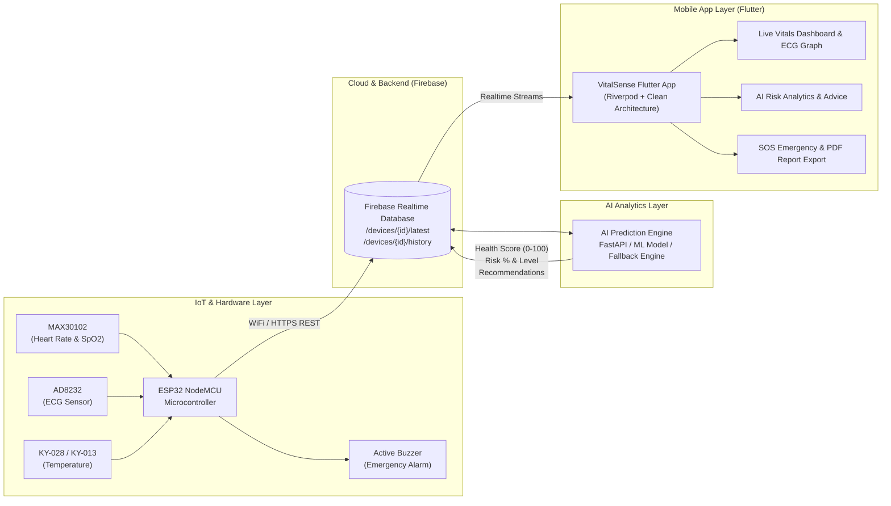

# 🏥 VitalSense — AI-Powered Remote Health Monitoring & Disease Prediction System

[](https://flutter.dev/)
[](https://dart.dev/)
[](https://www.espressif.com/)
[](https://www.arduino.cc/)
[](https://firebase.google.com/)
[](https://riverpod.dev/)

**VitalSense** একটি আধুনিক, এন্ড-টু-এন্ড রিমোট হেলথ মনিটরিং এবং ডিজিজ প্রেডিকশন সিস্টেম। এটি রিয়েল-টাইমে রোগীর শারীরিক প্যারামিটারগুলো (Heart Rate, SpO2, ECG, Body Temperature) সেন্সরের মাধ্যমে পরিমাপ করে ক্লাউডে পাঠায়, কৃত্রিম বুদ্ধিমত্তা (AI) দ্বারা বিশ্লেষণ করে সম্ভাব্য কার্ডিওভাসকুলার বা শারীরিক ঝুঁকি নির্ণয় করে এবং ক্রস-প্ল্যাটফর্ম ফ্লাটার অ্যাপ্লিকেশনে তাৎক্ষণিকভাবে উপস্থাপন করে।

---

## 📑 সূচিপত্র (Table of Contents)
- [System Architecture (সিস্টেম আর্কিটেকচার)](#-system-architecture)
- [Part 1: IoT & Sensor Hardware Layer (হার্ডওয়্যার ও সেন্সর পার্ট)](#-part-1-iot--sensor-hardware-layer)
- [Part 2: AI & Predictive Analytics Engine (কৃত্রিম বুদ্ধিমত্তা ও প্রেডিকশন পার্ট)](#-part-2-ai--predictive-analytics-engine)
- [Part 3: Flutter Mobile Application (ফ্লাটার মোবাইল অ্যাপ পার্ট)](#-part-3-flutter-mobile-application)
- [Project Directory Structure (প্রজেক্ট ডিরেক্টরি)](#-project-directory-structure)
- [Setup & Installation Guide (সেটআপ ও রান নির্দেশিকা)](#-setup--installation-guide)

---

## 🏛 System Architecture



---

## 📡 Part 1: IoT & Sensor Hardware Layer

হার্ডওয়্যার স্তরে রয়েছে একটি **ESP32 ESP-32S NodeMCU (30-pin)** মাইক্রোকন্ট্রোলার যা উচ্চগতির স্যাম্পলিং এবং ওয়্যারলেস কানেক্টিভিটি সরবরাহ করে।

### ১.১ সেন্সর ও মডিউল স্পেসিফিকেশন
| সেন্সর / উপাদান | ইন্টারফেস | পিন কানেকশন (ESP32) | কাজ / ভূমিকা |
| :--- | :--- | :--- | :--- |
| **MAX30102** | I2C Protocol | SDA -> `GPIO 21`<br/>SCL -> `GPIO 22` | পালস অক্সিমিটার ও হার্টরেট সেন্সর। রক্তের অক্সিজেন সম্পৃক্ততা (SpO2 %) ও পালস রেট (BPM) পরিমাপ করে। ফিঙ্গার ডিটেকশন ও রিয়েল-টাইম FIFO রিডিং সাপোর্ট করে। |
| **AD8232 ECG** | Analog + Digital | OUTPUT -> `GPIO 34` (ADC1)<br/>LO+ -> `GPIO 26`<br/>LO- -> `GPIO 27` | সিংগেল-লিড হার্ট রেট মনিটর। ইলেক্ট্রোকার্ডিওগ্রাম (ECG) ওয়েভফর্ম অ্যানালগ সিগন্যাল হিসেবে ১০০ হার্টজে (100 Hz) স্যাম্পল করে। লিড-অফ ডিটেকশন ক্ষমতা রয়েছে। |
| **Digital Temperature Module** | Digital GPIO | DATA (D0) -> `GPIO 4` | রোগীর শরীরের অস্বাভাবিক তাপমাত্রা বা জ্বর সনাক্ত করার ডিজিটাল থার্মোস্ট্যাট সেন্সর (অ্যাক্টিভ হাই সিগন্যাল)। |
| **Active Buzzer** | Digital GPIO | Signal -> `GPIO 25` | রোগীর ভাইটাল ক্রিটিক্যাল লেভেলে গেলে অন-বোর্ড সাউন্ড অ্যালার্ম প্রদান করে। |
| **ESP32 Wi-Fi** | 802.11 b/g/n | Internal | লোকাল ওয়াইফাই নেটওয়ার্কের সাথে স্বয়ংক্রিয়ভাবে সংযুক্ত হয় এবং ক্লাউডে ডেটা পাঠায়। |

### ১.২ ফার্মওয়্যার আর্কিটেকচার (`HealthMonitoring/`)
- **নন-ব্লকিং শিডিউলার (Non-blocking Cooperative Scheduler):** ফার্মওয়্যারের `loop()` মেথডে কোনো ব্লকিং `delay()` ব্যবহার করা হয়নি। `millis()` টাইমার ব্যবহার করে প্রতিটি সেন্সরের নির্ধারিত ফ্রিকোয়েন্সিতে রিডিং নেওয়া হয়:
  - **ECG Sampling:** 100 Hz (প্রতি ১০ মিলিসেকেন্ড পরপর)
  - **MAX30102 FIFO Polling:** Continuous / 1 Hz
  - **Temperature Voting:** 1 Hz (৫-স্যাম্পল মেজরিটি ভোটিং ফিল্টারিং)
  - **Buzzer State Machine:** 20 Hz
- **নয়েজ ফিল্টারিং ও মেজরিটি ভোটিং:** তাপমাত্রা সেন্সরের জন্য ৫-স্যাম্পল স্লাইডিং উইন্ডো মেজরিটি ভোটিং অ্যালগরিদম ব্যবহার করা হয়েছে যাতে কোনো নয়েজের কারণে ভুল অ্যালার্ম না বাজে।
- **ক্লাউড আপলিংক:** `WiFiClientSecure` এবং REST HTTPS মেথডের মাধ্যমে সরাসরি Firebase Realtime Database-এর নিম্নোক্ত নোডগুলোতে ডেটা পুশ করা হয়:
  - `/devices/{deviceId}/latest.json` (প্রতি ১ সেকেন্ডে সর্বশেষ স্ন্যাপশট)
  - `/devices/{deviceId}/history.json` (প্রতি ৫ সেকেন্ডে হিস্টোরিক্যাল লগ)
  - `/alerts.json` (জরুরি অবস্থা দেখা দিলে তাৎক্ষণিক অ্যালার্ট)

---

## 🧠 Part 2: AI & Predictive Analytics Engine

ভাইটালসেন্স সিস্টেমে রোগীদের সংগৃহীত বায়োমেট্রিক ডেটা বিশ্লেষণ করে বিভিন্ন কার্ডিওভাসকুলার এবং সিস্টেমিক স্বাস্থ্যঝুঁকি পূর্বাভাস দেওয়ার জন্য একটি ইন্টেলিজেন্ট ইঞ্জিন তৈরি করা হয়েছে।

### ২.১ কোর ফিচার ও মেট্রিক্স
1. **Health Score Calculation (০ থেকে ১০০ স্কোর):**
   - রোগীর সামগ্রিক সুস্থতার পরিমাণ বোঝাতে ০ থেকে ১০০ পর্যন্ত একটি কমপ্রিহেনসিভ স্কোর তৈরি হয়।
   - রক্তে অক্সিজেন স্তর ($SpO_2$), হৃদস্পন্দন ($BPM$), এবং তাপমাত্রার সমন্বয়ে রিয়েল-টাইমে স্কোর আপডেট হয়।
2. **Cardiovascular & Disease Risk Assessment (ঝুঁকির শতাংশ):**
   - রোগীর হার্ট ডিজিজ এবং অন্যান্য স্বাস্থ্যঝুঁকির সম্ভাবনা (০% - ১০০%) গণনা করা হয়।
   - ঝুঁকিকে ৪টি প্রধান স্তরে ভাগ করা হয়:
     - 🟢 **Low Risk (কম ঝুঁকি):** স্বাস্থ্য সম্পূর্ণ স্বাভাবিক।
     - 🟡 **Moderate Risk (মাঝারি ঝুঁকি):** সামান্য বিচ্যুতি, সতর্কতা প্রয়োজন।
     - 🟠 **High Risk (উচ্চ ঝুঁকি):** অবিলম্বে জীবনধারা পরিবর্তন বা ডাক্তারের পরামর্শ প্রয়োজন।
     - 🔴 **Critical Risk (জরুরি অবস্থা):** সম্ভাব্য কার্ডিয়াক অ্যারেস্ট বা মারাত্মক হাইপোক্সিয়া।
3. **Arrhythmia & Abnormal ECG Pattern Detection:**
   - ব্র্যাডিকার্ডিয়া ($<50$ BPM), ট্যাকিকার্ডিয়া ($>120$ BPM), এবং অনিয়মিত ইসিজি বিট প্যাটার্ন সনাক্তকরণ।
4. **ডাইনামিক ক্লিনিক্যাল রিকমেন্ডেশন (AI Recommendations):**
   - রোগীর বর্তমান অবস্থা অনুযায়ী রিয়েল-টাইম স্বাস্থ্য পরামর্শ (যেমন: আর্দ্র থাকা, ডাক্তারের সাথে যোগাযোগ করা, গভীর শ্বাস নেওয়া ইত্যাদি)।

### ২.২ ডেটা ও প্রেডিকশন পে-লোড স্ট্রাকচার
ক্লাউড বা ব্যাকএন্ড থেকে ফ্লাটার অ্যাপে আসা প্রেডিকশন স্কিমার উদাহরণ:
```json
{
  "ts": 1725814800000,
  "health_score": 88,
  "heart_disease_risk": 12,
  "risk_level": "low",
  "abnormal_heart": false,
  "emergency": false,
  "model_version": "vitals-v1.2.0",
  "hr_resolved": 74,
  "hr_source": "sensor",
  "hr_confidence": 0.98,
  "recommendations": [
    "Maintain regular hydration throughout the day.",
    "Target 30 minutes of moderate aerobic exercise.",
    "Vitals are stable; continue regular monitoring."
  ]
}
```

### ২.৩ ফলব্যাক ও অফলাইন ইন্টেলিজেন্স
যদি ক্লাউড কানেক্টিভিটি বা AI সার্ভারে কোনো ব্যাঘাত ঘটে, তবে ফ্লাটার অ্যাপের ভেতর নির্মিত লোকাল রুল-বেসড ইনফারেন্স ইঞ্জিন (`vitals_repository.dart`) কার্যকর হয়, যাতে ব্যবহারকারী কোনো অবস্থাতেই সুরক্ষা সেবা থেকে বঞ্চিত না হন।

---

## 📱 Part 3: Flutter Mobile Application

মোবাইল অ্যাপ্লিকেশনটি **Flutter (Dart 3)** ব্যবহার করে ক্লিন আর্কিটেকচার এবং ফিচারের ভিত্তিতে মডিউলার পদ্ধতিতে তৈরি করা হয়েছে।

### ৩.১ প্রযুক্তি স্ট্যাক ও প্যাকেজসমূহ
- **State Management:** `flutter_riverpod` (রিঅ্যাকটিভ এবং টেস্টেবল স্টেট হ্যান্ডলিং)
- **Navigation:** `go_router` (ডিপ-লিঙ্কিং ও ডিক্লোরেটিভ রাউটিং)
- **Database & Cloud:** `firebase_core`, `firebase_auth`, `firebase_database`
- **Visualization:** `fl_chart` (রিয়েল-টাইম ইসিজি ওয়েভফর্ম এবং হিস্টোরি গ্রাফ), `percent_indicator`
- **Audio & Alerts:** `audioplayers` (জরুরি সাইরেন), `flutter_local_notifications`
- **Reports & Export:** `pdf`, `printing`, `csv`, `share_plus`
- **UI & Animations:** Modern Glassmorphism, Animated Gradient Backgrounds, `google_fonts`, `flutter_animate`, `shimmer`

### ৩.২ মূল মডিউল ও স্ক্রিনসমূহ
1. **লাইভ ড্যাশবোর্ড (`features/dashboard`):**
   - রিয়েল-টাইম হার্ট রেট, অক্সিজেন ($SpO_2$), এবং শরীরের তাপমাত্রা কার্ড।
   - হেলথ স্কোর ডায়াল রিং ও স্পার্কলাইন চার্ট।
   - ডিভাইস স্ট্যাটাস ব্যাজ (অনলাইন/অফলাইন, ব্যাটারি ও ওয়াইফাই আরএসএসআই)।
2. **লাইভ ইসিজি ট্র্যাকার (`features/ecg`):**
   - অ্যাডভান্সড রিয়েল-টাইম ইসিজি ওয়েভফর্ম গ্রাফিং।
   - লিড-অফ ওয়ার্নিং এবং সিগন্যাল কোয়ালিটি ইন্ডিকেটর।
3. **এআই অ্যানালাইসিস স্ক্রিন (`features/ai_analysis`):**
   - সার্বিক স্বাস্থ্য স্কোর এবং বিস্তারিত কার্ডিওভাসকুলার রিস্ক কার্ড।
   - এআই জেনারেটেড ক্লিনিক্যাল পরামর্শ ও লাইফস্টাইল নির্দেশিকা।
4. **ইমার্জেন্সি ও এসওএস অ্যালার্ট (`features/emergency`):**
   - ভাইটালস ক্রিটিক্যাল রেঞ্জে পৌঁছালে স্বয়ংক্রিয় স্থানীয় সাইরেন এবং পুশ নোটিফিকেশন।
   - তাৎক্ষণিক ওয়ান-ট্যাপ ইমার্জেন্সি কন্টাক্ট ডায়ালিং।
5. **হিস্টোরিক্যাল ট্রেন্ডস ও রিপোর্ট এক্সপোর্ট (`features/reports`, `features/history`):**
   - পূর্ববর্তী স্বাস্থ্য রেকর্ডের সময়ভিত্তিক ফিল্টারিং (24h / 7d)।
   - চিকিৎসকের সাথে শেয়ারের জন্য প্রফেশনাল ক্লিনিক্যাল **PDF রিপোর্ট** জেনারেশন এবং **CSV ডেটা এক্সপোর্ট**।
6. **ইউজার প্রোফাইল ও ডিভাইস পেয়ারিং (`features/profile`, `features/device`):**
   - ব্যবহারকারীর ব্যক্তিগত স্বাস্থ্য তথ্য ও ইমার্জেন্সি কন্টাক্ট কনফিগারেশন।
   - ESP32 হার্ডওয়্যার কানেক্টিভিটি পর্যবেক্ষণ।

---

## 📂 Project Directory Structure

```text
ai_powered_health_monitoring_app/
│
├── HealthMonitoring/               # 🔌 IoT / Firmware Layer (C++ & Arduino)
│   ├── HealthMonitoring.ino        # প্রধান ফার্মওয়্যার লুপ ও নন-ব্লকিং শিডিউলার
│   ├── config.h                    # পিনআউট, থ্রেশহোল্ড ও সিস্টেম কনফিগারেশন
│   ├── secrets.h                   # ওয়াইফাই ক্রেডেনশিয়াল ও সিক্রেট কি
│   ├── max30102.cpp / .h           # MAX30102 সেন্সর ড্রাইভার ও FIFO প্রসেসিং
│   ├── ecg.cpp / .h                # AD8232 ইসিজি সিগন্যাল স্যাম্পলার
│   ├── temperature.cpp / .h        # ডিজিটাল টেম্পারেচার উইন্ডোড ভোটিং
│   ├── buzzer.cpp / .h             # ইমার্জেন্সি বাজার স্টেট মেশিন
│   ├── MyWiFiManager.cpp / .h      # অটোমেটিক ওয়াইফাই কানেকশন ম্যানেজার
│   ├── firebase.cpp / .h           # ফায়ারবেস রিয়েলটাইম ডেটাবেস REST ক্লায়েন্ট
│   └── display.cpp / .h            # সিরিয়াল ডিবাগ ও ডিসপ্লে হ্যান্ডলার
│
├── lib/                            # 📱 Flutter Mobile Application Layer
│   ├── app/                        # রাউটিং, গ্লোবাল থিম এবং অ্যাপ কনফিগ
│   ├── core/                       # রিইউজেবল উইজেটস, ইউটিলিটিস এবং নেটওয়ার্ক হেল্পার
│   ├── features/                   # ফিচার-ভিত্তিক মডিউলার আর্কিটেকচার
│   │   ├── ai_analysis/            # AI প্রেডিকশন এবং রিস্ক স্ক্রিন
│   │   ├── auth/                   # ফায়ারবেস অথেন্টিকেশন (লগইন / সাইনআপ)
│   │   ├── dashboard/              # রিয়েল-টাইম ভাইটালস মনিটরিং ড্যাশবোর্ড
│   │   ├── device/                 # ESP32 ডিভাইস স্ট্যাটাস ও কানেক্টিভিটি
│   │   ├── ecg/                    # লাইভ ইসিজি ওয়েভফর্ম স্ক্রিন
│   │   ├── emergency/              # জরুরি এসওএস এবং অ্যালার্ট নোটিফিকেশন
│   │   ├── history/                # ঐতিহাসিক ট্রেন্ড ও চার্ট
│   │   ├── profile/                # রোগী ও ডাক্তারের প্রোফাইল
│   │   ├── reports/                # পিডিএফ ও সিএসভি হেলথ রিপোর্ট এক্সপোর্টার
│   │   └── vitals/                 # Vitals repository, data models & providers
│   ├── firebase_options.dart       # ফায়ারবেস প্ল্যাটফর্ম কনফিগারেশন
│   └── main.dart                   # অ্যাপ্লিকেশন এন্ট্রি পয়েন্ট
│
├── assets/                         # আইকন, সাউন্ড ও অ্যানিমেশন এসেট
├── pubspec.yaml                    # ফ্লাটার ডিপেনডেন্সি ও প্যাকেজ তালিকা
└── README.md                       # সার্বিক প্রজেক্ট ডকুমেন্টেশন
```

---

## 🚀 Setup & Installation Guide

### ১. হার্ডওয়্যার ও ফার্মওয়্যার সেটআপ
1. **Arduino IDE** ওপেন করুন এবং প্রয়োজনীয় ESP32 বোর্ড প্যাকেজ ইনস্টল করুন।
2. `HealthMonitoring/secrets.h` ফাইলে আপনার ওয়াইফাই SSID, পাসওয়ার্ড এবং ফায়ারবেস ক্রেডেনশিয়াল প্রদান করুন:
   ```cpp
   #define WIFI_SSID     "Your_WiFi_Name"
   #define WIFI_PASSWORD "Your_WiFi_Password"
   ```
3. ESP32 বোর্ডকে USB ক্যাবল দিয়ে কম্পিউটারে কানেক্ট করুন এবং সঠিক COM Port ও Board (`ESP32 Dev Module`) নির্বাচন করে **Upload** বাটনে ক্লিক করুন।
4. সিরিয়াল মনিটরে (Baud: `115200`) সেন্সর ডেটা ও ওয়াইফাই কানেকশন স্ট্যাটাস পর্যবেক্ষণ করুন।

### ২. ফায়ারবেস কনফিগারেশন
1. [Firebase Console](https://console.firebase.google.com/)-এ একটি প্রজেক্ট তৈরি করুন।
2. **Realtime Database** এবং **Firebase Authentication** সক্রিয় করুন।
3. ডেটাবেস রুলস আপডেট করুন (`database.rules.json` অনুযায়ী)।
4. `flutterfire configure` কমান্ড চালিয়ে `firebase_options.dart` আপডেট করে নিন।

### ৩. ফ্লাটার মোবাইল অ্যাপ চালানো
1. প্রজেক্টের রুট ডিরেক্টরিতে কমান্ড টার্মিনাল ওপেন করুন।
2. প্যাকেজগুলো ডাউনলোড করতে রান করুন:
   ```bash
   flutter pub get
   ```
3. আপনার অ্যান্ড্রয়েড বা আইওএস ডিভাইস/ইমুলেটর চালু রেখে অ্যাপটি রান করুন:
   ```bash
   flutter run
   ```
4. প্রোডাকশন রিলিজ APK বিল্ড করতে:
   ```bash
   flutter build apk --release
   ```

---

## 🛡️ License & Disclaimer
This project is licensed under the [MIT License](LICENSE).

This project is developed for educational, research, and remote monitoring purposes. While designed for precision, it should not be considered a substitute for certified medical-grade intensive care equipment. Always consult qualified healthcare professionals for medical diagnoses.
